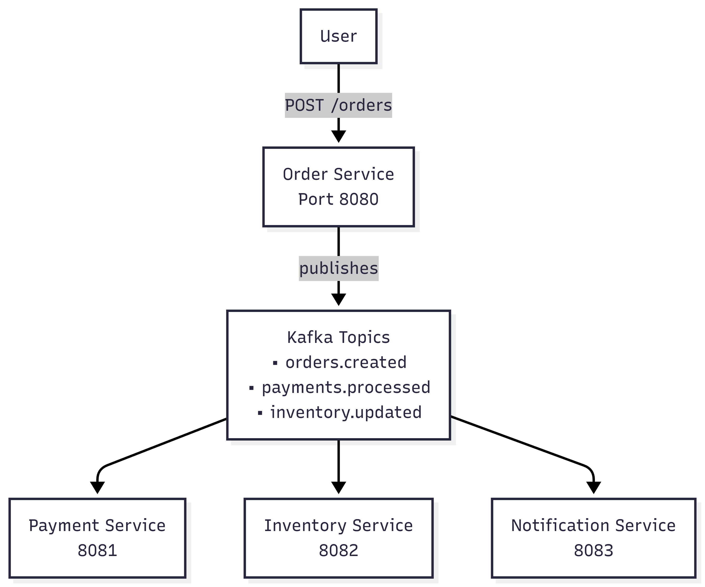
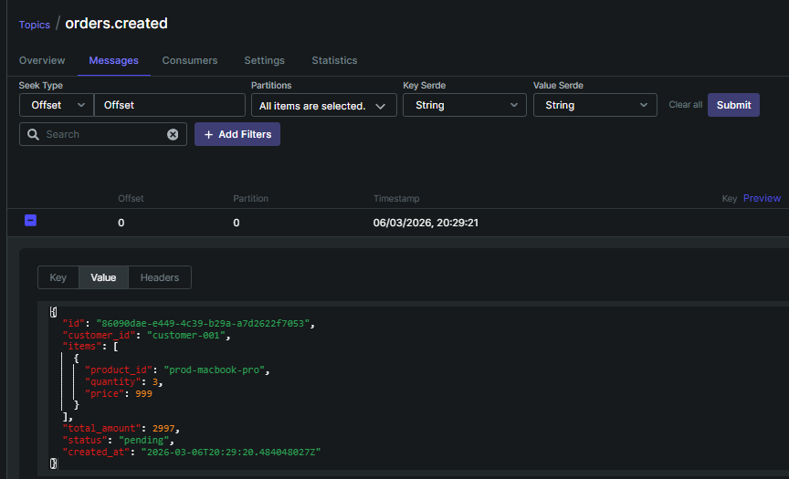
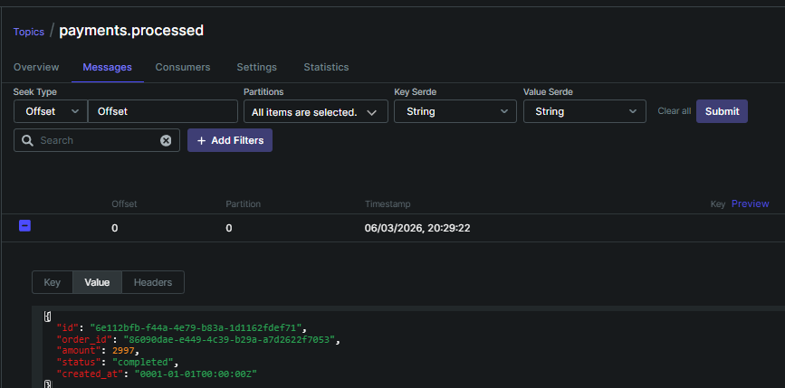
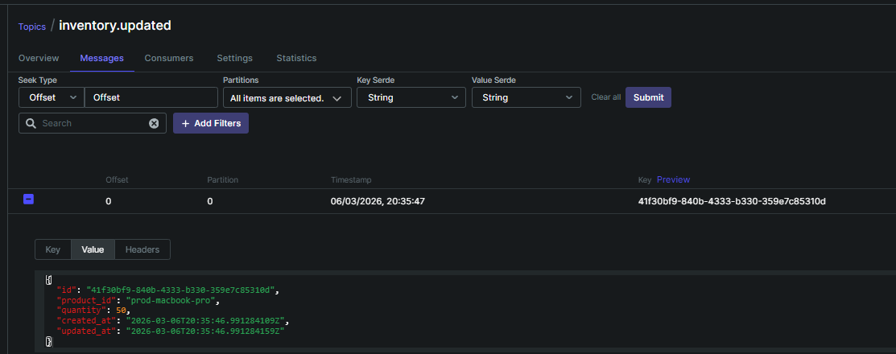
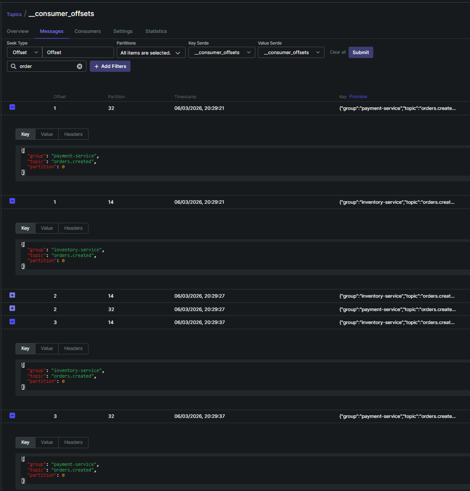

# Sistema de Processamento de Pedidos Event-Driven

Um sistema distribuído construído com Go que demonstra arquitectura event-driven usando Kafka para comunicação assíncrona entre microsserviços independentes.

## Visão Geral

Quatro microsserviços tratam diferentes domínios de um pipeline de processamento de pedidos. Cada serviço é totalmente independente, com a sua própria base de dados e ciclo de vida de deployment. Os serviços comunicam exclusivamente através de tópicos Kafka — sem chamadas HTTP directas entre serviços.

## Arquitectura



O diagrama mostra o fluxo completo: o utilizador faz um `POST /orders`, o **order-service** persiste a order e publica um evento no Kafka. A partir daí, **payment-service** e **inventory-service** consomem esse evento de forma independente e assíncrona — sem nenhuma chamada HTTP directa entre serviços.

```
order-service     →  orders.created     →  payment-service, inventory-service
order-service     →  orders.cancelled   →  payment-service, inventory-service
payment-service   →  payments.processed →  inventory-service, notification-service
payment-service   →  payments.failed    →  notification-service
inventory-service →  inventory.updated  →  notification-service
```

### Serviços

| Serviço              | Porta | Base de Dados      | Responsabilidade                        |
|----------------------|-------|--------------------|-----------------------------------------|
| order-service        | 8080  | PostgreSQL         | Criar e gerir pedidos                   |
| payment-service      | 8081  | PostgreSQL         | Processar pagamentos                    |
| inventory-service    | 8082  | PostgreSQL + Redis | Gerir níveis de stock                   |
| notification-service | 8083  | —                  | Consumir eventos e enviar notificações  |

### Stack Tecnológica

- **Go** — todos os serviços
- **Kafka** — mensageria assíncrona (Confluent 7.5.0)
- **PostgreSQL 16** — armazenamento persistente (um container, bases de dados separadas)
- **Redis 7** — camada de cache para o inventory-service
- **Gin** — framework HTTP
- **Docker Compose** — infraestrutura local

## Estrutura do Projecto

Cada serviço segue a mesma estrutura de Clean Architecture:

```
service/
├── cmd/service/        # Composition root (main.go)
└── internal/
    ├── domain/         # Entidades — sem dependências externas
    ├── usecase/        # Lógica de negócio + definição de interfaces
    ├── repository/     # Implementações PostgreSQL (+ Redis)
    ├── handler/        # Handlers HTTP com Gin
    └── kafka/          # Producer/consumer Kafka
```

Direcção de dependências: `handler` → `usecase` → `domain` ← `repository`, `kafka`

## Como Executar

### Pré-requisitos

- Docker e Docker Compose
- Go 1.21+

### Executar com Docker

```bash
# Iniciar infraestrutura (Kafka, PostgreSQL, Redis)
make docker-up

# Iniciar tudo incluindo os serviços
make docker-up-all

# Parar todos os containers
make docker-down

# Ver logs
make docker-logs
```

### Executar Localmente

Copiar o ficheiro de ambiente para cada serviço:

```bash
cp order-service/.env.example order-service/.env
cp payment-service/.env.example payment-service/.env
cp inventory-service/.env.example inventory-service/.env
cp notification-service/.env.example notification-service/.env
```

Iniciar cada serviço:

```bash
make run-order
make run-payment
make run-inventory
make run-notif
```

### Kafka UI

Disponível em [http://localhost:8090](http://localhost:8090) — inspecionar tópicos, mensagens e consumer groups.

## Endpoints da API

### order-service (porta 8080)
```
POST /orders        Criar um novo pedido
GET  /orders/:id    Obter pedido por ID
```

### payment-service (porta 8081)
```
POST /payments      Processar um pagamento
GET  /payments/:id  Obter pagamento por ID
```

### inventory-service (porta 8082)
```
POST /inventory        Criar item de inventário
GET  /inventory/:id    Obter item por ID de produto
PUT  /inventory/:id    Actualizar stock
```

## Desenvolvimento

```bash
# Build de todos os serviços
make build

# Executar testes
make test

# go mod tidy em todos os serviços
make tidy
```

Executar testes de um serviço específico:

```bash
cd order-service && go test ./internal/usecase/...
```

> Se `go mod tidy` falhar com "go.mod file not found", usar o prefixo `GOPATH=/tmp/gopath`:
> ```bash
> cd order-service && GOPATH=/tmp/gopath go mod tidy
> ```

## Sistema em Funcionamento

Este projecto é um exercício prático de aprendizagem de arquitectura event-driven com Go e Kafka. Os prints abaixo mostram o sistema a correr com os eventos a fluir entre serviços.

### orders.created



Quando um `POST /orders` é feito, o **order-service** guarda a order na base de dados e publica este evento no tópico `orders.created`. O payload contém o ID único da order, os itens, o valor total e o status `pending`.

### payments.processed



O **payment-service** consome o evento `orders.created`, processa o pagamento e publica `payments.processed`. O `order_id` liga este evento à order original — é assim que os serviços se relacionam sem chamadas HTTP directas.

### inventory.updated



O **inventory-service** consome tanto `orders.created` como `payments.processed` e actualiza o stock. Publica `inventory.updated` com o novo estado do produto.

### Consumer Offsets



O Kafka mantém o registo de quais mensagens cada serviço já consumiu (offset). Aqui vemos **payment-service** e **inventory-service** a consumir independentemente o mesmo tópico `orders.created` — cada um no seu próprio consumer group, sem interferir um com o outro.

---

> **Nota:** Este projecto foi desenvolvido com fins educacionais para demonstrar os princípios de Clean Architecture e comunicação assíncrona via Kafka em sistemas distribuídos.
